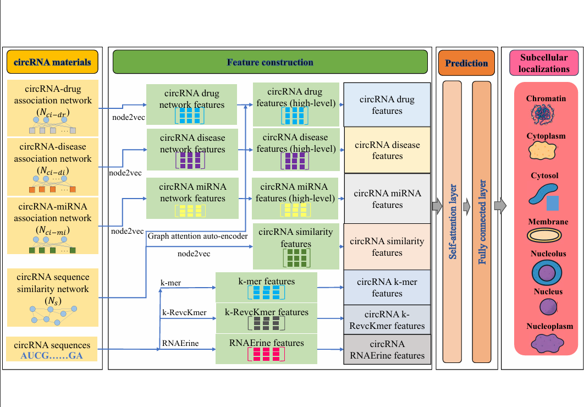

# CircLoc

CircLoc is designed to predict the subcellular localizations of circRNAs. It employs circRNA sequence and network information, from which informative circRNA features are extracted via traditional methods (e.g. k-mer), large language model (RNAErnie), and network representation learning algorithms (e.g. node2vec, graph attention auto-encoder). These features are processed by a self-attention layer and finally fed into a fully connected layers for prediction.

# Requirements 

Tensorflow = 1.14.0 

python = 3.7.16 

scikit-learn = 1.0.2

networkx = 2.6.3

